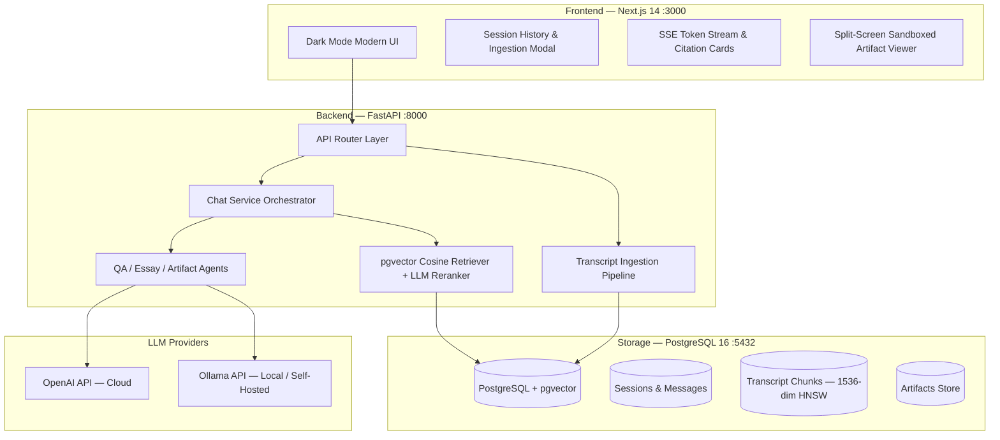

# The Lenny Growth Assistant

> An AI-powered conversational web application that transforms **Lenny's Podcast transcripts** into a reliable, grounded product and growth intelligence system.

[](https://fastapi.tiangolo.com)
[](https://nextjs.org)
[](https://github.com/pgvector/pgvector)
[](https://www.docker.com)
[](https://opensource.org/licenses/MIT)

---

## Overview and Capabilities

The **Lenny Growth Assistant** is engineered for Product Managers, Growth Leaders, and Founders who want instant, evidence-backed answers and structured strategic deliverables from the world's top product minds interviewed on Lenny's Podcast.

### Key Capabilities

1. **Grounded Conversational Q&A**: Every answer is strictly grounded in vector-embedded transcript chunks with speaker attribution, episode citations, similarity confidence metrics, and verbatim quotes.
2. **Ship 30 for 30 Content Skill**: A dedicated writing engine applying the atomic essay framework (~1,250 words, strong hook, common pain point, core mental model, 1-2-3 actionable steps, one-line takeaway).
3. **Interactive Growth Artifacts**: Emits Markdown strategy memos, retention loop teardowns, and sandboxed interactive HTML/CSS calculators in a split-screen workspace beside the chat interface.
4. **Flexible LLM Provider Configuration**: Zero-downtime runtime switching between cloud providers (**OpenAI** `gpt-4o-mini`, `gpt-4o`) and local providers (**Ollama** `llama3.1:8b`) with automated fallback and diagnostics.
5. **Transcript Ingestion Pipeline**: Ingest and chunk custom podcast transcripts on-the-fly via the UI modal or REST API with metadata extraction and HNSW indexing.

---

## System Architecture



---

## Project Structure & Deliverables

```
lenny-growth-assistant/
├── agent_transcripts/          # Coding agent logs, failure traces, & resolutions
│   ├── README.md
│   ├── 01_rag_and_pgvector_setup.log
│   ├── 02_clerk_and_dep_resolution.log
│   ├── 03_gitignore_lib_unignore.log
│   └── 04_artifact_sanitization_qa.log
├── backend/                    # FastAPI backend service
│   ├── app/
│   │   ├── api/                # REST & SSE streaming endpoints
│   │   ├── agents/             # QAAgent, Ship30EssayGenerator, ArtifactAgent
│   │   ├── infrastructure/     # OpenAI & Ollama providers
│   │   ├── persistence/        # SQLAlchemy models & repositories
│   │   ├── retrieval/          # Chunker, Embedder, pgvector retriever
│   │   └── services/           # Chat, Session, and Ingestion services
│   ├── data/transcripts/       # Sample podcast transcripts
│   ├── scripts/                # Seeding and maintenance scripts
│   └── tests/                  # Pytest automated test suite
├── docs/                       # Technical documentation & PRD
│   ├── PRD.md                  # Product Requirements Document & Discovery Brief
│   ├── architecture.md         # System Architecture & Database Schema
│   ├── design.md               # UI/UX Specification & Design System
│   └── qa-checklist.md         # QA Test Plan & Evaluation Matrix
├── frontend/                   # Next.js 14 UI with TailwindCSS & TypeScript
│   ├── src/
│   │   ├── app/                # Next.js App Router pages
│   │   ├── components/         # Chat, Artifact Viewer, Sidebar components
│   │   ├── hooks/              # Custom React state & SSE hooks
│   │   └── lib/                # API client & DOMPurify sanitizer
├── docker-compose.yml          # One-command full-stack container setup
├── Makefile                    # Utility shortcuts for setup, seeding, and testing
└── README.md                   # Evaluator deployment guide
```

---

## Prerequisites

- **Docker & Docker Compose**: Installed and running on host system.
- **Node.js 18+ & Python 3.11+**: (Optional) Required only if running services outside Docker.
- **OpenAI API Key**: (Optional) Required for cloud LLM execution (`gpt-4o-mini`).
- **Ollama**: (Mandatory for local demo) Download from [ollama.com](https://ollama.com) and pull `llama3.1:8b` via `ollama pull llama3.1:8b`.

---

## Quickstart Guide

### 1. Clone Repository & Set Up Environment

```bash
git clone https://github.com/ryqtor/podbase.git
cd lenny-growth-assistant

# Copy environment variable template
cp .env.example .env
```

Set environment variables in `.env` (or keep defaults):

```env
# Database Credentials
POSTGRES_USER=lenny_user
POSTGRES_PASSWORD=lenny_password
POSTGRES_DB=lenny_db
POSTGRES_HOST=postgres
POSTGRES_PORT=5432

# LLM Providers
OPENAI_API_KEY=your_openai_api_key_here
DEFAULT_LLM_PROVIDER=openai # Set to 'ollama' for local execution

# Ollama Local Service
OLLAMA_BASE_URL=http://host.docker.internal:11434
OLLAMA_MODEL=llama3.1:8b
```

---

### 2. Start System via Docker Compose

Run the one-command deployment workflow:

```bash
docker compose up -d
```

This starts:
- **PostgreSQL 16 with pgvector**: Listening on port `5432`.
- **FastAPI Backend**: Listening on port `8000`.
- **Next.js 14 Frontend**: Listening on port `3000`.

---

### 3. Seed Transcript Knowledge Base

Seed the vector store with initial high-signal transcripts (Brian Chesky on Founder Mode, Elena Verna on Growth Loops, Shreyas Doshi on LNO Framework):

```bash
docker compose exec backend python scripts/seed_transcripts.py
```

---

### 4. Access the Application

- **Frontend Interface**: [http://localhost:3000](http://localhost:3000)
- **FastAPI OpenAPI (Swagger)**: [http://localhost:8000/docs](http://localhost:8000/docs)
- **System Health & Provider Diagnostics**: [http://localhost:8000/health](http://localhost:8000/health)

---

## Local Ollama Setup (Mandatory Demo Requirement)

To run the application entirely offline using local hardware via Ollama:

1. **Install Ollama** on host system:
   ```bash
   curl -fsSL https://ollama.com/install.sh # macOS/Linux
   # Or download installer for Windows from https://ollama.com
   ```

2. **Pull the Llama 3.1 Model**:
   ```bash
   ollama pull llama3.1:8b
   ```

3. **Switch Model in UI or .env**:
   - **In UI**: Select `Ollama (llama3.1:8b)` from the floating provider dropdown in the chat toolbar.
   - **In .env**: Update `DEFAULT_LLM_PROVIDER=ollama`.

---

## Evaluation Prompts & Verification Plan

Use the following prompts to test the core features:

| Intent | Test Prompt | Expected System Behavior |
|---|---|---|
| **Grounded Q&A** | *"What is Founder Mode according to Brian Chesky and why does he advise against traditional delegating?"* | Returns attributed answer citing Episode #142 with speaker name, similarity score, and excerpt quotes. |
| **Framework Synthesis** | *"Explain the LNO Framework by Shreyas Doshi and why the Impact vs Effort matrix fails."* | Synthesizes Leverage, Neutral, and Overhead tasks based on Episode #95 transcripts. |
| **Ship 30 for 30 Essay** | *"Write a Ship 30 for 30 style essay about why growth loops beat traditional marketing funnels."* | Generates a 1,250-word structured atomic essay (Hook, Problem, Framework, 1-2-3 Steps, Takeaway). |
| **Interactive Artifact** | *"Generate a strategic launch plan and growth loop teardown for a B2B SaaS product."* | Opens split-screen Artifact Viewer on the right with formatted strategy memo and export buttons. |
| **Out-of-Domain Guardrail** | *"What is the best way to bake sourdough bread?"* | Triggers disclaimer stating the topic is outside the available transcript knowledge base. |

---

## Makefile Command Reference

| Command | Description |
|---|---|
| `make build` | Rebuild all Docker containers |
| `make up` | Start full-stack application in background |
| `make up-ollama` | Start application with Ollama integration enabled |
| `make seed` | Embed and ingest sample transcripts into pgvector |
| `make test` | Run backend Pytest test suite |
| `make lint` | Run code quality linters across backend and frontend |
| `make down` | Stop all running Docker containers |
| `make clean` | Stop containers and wipe PostgreSQL volume data |

---

## Engineering & Architecture Decisions

1. **Unified Relational & Vector Persistence with pgvector**:
   - **Decision**: Used `pgvector` inside PostgreSQL 16 rather than an external vector database (Chroma, Pinecone).
   - **Rationale**: Eliminates multi-database synchronization risks, provides ACID compliance for chat sessions and embeddings, and delivers sub-5ms HNSW vector searches.

2. **Strict Layered Separation**:
   - **Decision**: Decoupled routes (`api`), orchestration (`services`), agent execution (`agents`), and data providers (`infrastructure`).
   - **Rationale**: Allows swapping LLM providers or chunking algorithms without changing domain business logic.

3. **Artifact Security via DOMPurify & Sandboxed Iframe**:
   - **Decision**: Rendered generated HTML inside `<iframe sandbox="allow-scripts allow-same-origin">` with client-side DOMPurify tag whitelisting.
   - **Rationale**: Eliminates XSS and script injection vulnerabilities while allowing interactive HTML components.

---

## Troubleshooting Guide

### 1. `npm error ERESOLVE` on Installation
- **Solution**: Ensure install command uses `npm install --legacy-peer-deps` or `.npmrc` with `legacy-peer-deps=true`.

### 2. `Module Not Found: Can't resolve '@/lib/...'`
- **Solution**: Ensure `.gitignore` does not contain generic `lib/` line. All frontend utility files are located in `frontend/src/lib/`.

### 3. Database Connection Failure on `docker compose up`
- **Solution**: Wait 10 seconds for PostgreSQL container health check to pass before seeding data. Run `docker compose logs -f postgres` to monitor status.

### 4. Ollama Provider Connection Timeout
- **Solution**: Verify Ollama daemon is running on host with `ollama list`. On Linux/Docker for Desktop, verify `host.docker.internal` is reachable from inside the backend container.

---

## Technical Documentation Links

- [Product Requirements Document (PRD)](docs/PRD.md)
- [System Architecture Specification](docs/architecture.md)
- [UI/UX Design System Specification](docs/design.md)
- [QA & Evaluation Checklist](docs/qa-checklist.md)
- [Agent Execution Transcripts & Logs](agent_transcripts/README.md)

---

## Demo Video & Submission

- **Submission Form**: [Google Form Link](https://forms.gle/LgotDHNVxW1mbzNE7)
- **Demo Video**: Uploaded to YouTube demonstrating system architecture, grounded Q&A, Ship 30 for 30 essay generation, interactive artifact split-screen viewer, and local Ollama model switching.

---

## License

MIT License. Developed for The Lenny Growth Assistant Technical Evaluation.
